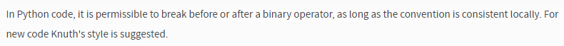
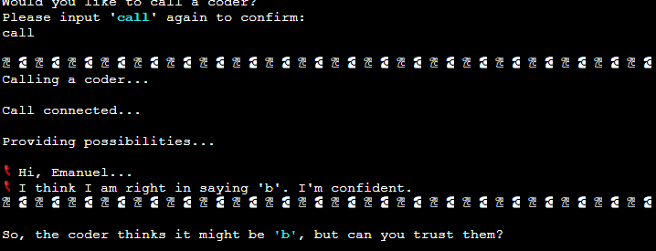

# Computer Literate Investigator

A gentle reminder to all - to open links in a new tab,
hold 'Ctrl' (or '⌘' on Apple devices) as you click!


## Live Site

[**C**omputer **L**iterate **I**nvestigator](
  https://computer-literate-investigator.herokuapp.com/)

## Repository

[https://github.com/daveyjh/ci-portfolio-three](
  https://github.com/daveyjh/ci-portfolio-three)

---

## Table of Contents

- [Computer Literate Investigator](#computer-literate-investigator)
  - [Live Site](#live-site)
  - [Repository](#repository)
  - [Table of Contents](#table-of-contents)
  - [Objective](#objective)
  - [Brief](#brief)
    - [**C**omputer **L**iterate **I**nvestigator](#computer-literate-investigator-1)
  - [UX &#8722; User Experience Design](#ux--user-experience-design)
    - [User Requirements](#user-requirements)
      - [First Time User](#first-time-user)
      - [Returning User](#returning-user)
      - [Interested Party](#interested-party)
    - [Initial Concept](#initial-concept)
      - [Wireframes](#wireframes)
        - [Desktop](#desktop)
        - [Mobile](#mobile)
      - [Colour Scheme](#colour-scheme)
      - [Typography](#typography)
      - [Imagery](#imagery)
  - [Logic](#logic)
    - [Initial Flow](#initial-flow)
    - [Python Logic](#python-logic)
  - [Features](#features)
    - [Existing Features](#existing-features)
      - [UX](#ux)
      - [Keywords](#keywords)
    - [Features Left to Implement](#features-left-to-implement)
  - [Technologies Used](#technologies-used)
    - [Python Packages](#python-packages)
    - [Other Tech](#other-tech)
      - [VSCode Extensions](#vscode-extensions)
  - [Testing](#testing)
    - [Python Testing](#python-testing)
      - [Manual Python Testing](#manual-python-testing)
        - [Manual Testing Documentation](#manual-testing-documentation)
      - [PEP8 Testing](#pep8-testing)
      - [Other Python Testing](#other-python-testing)
    - [W3C Validator](#w3c-validator)
      - [HTML](#html)
      - [CSS](#css)
    - [JSHint](#jshint)
    - [Lighthouse](#lighthouse)
  - [Bugs](#bugs)
    - [Current](#current)
    - [Resolved](#resolved)
  - [Development](#development)
    - [GitHub](#github)
    - [VSCode](#vscode)
      - [Cloning](#cloning)
      - [Editing](#editing)
    - [Working With Python](#working-with-python)
      - [Venv](#venv)
      - [Packages](#packages)
      - [Debugging](#debugging)
    - [Google Sheets](#google-sheets)
      - [Creating Sheets](#creating-sheets)
      - [API Credentials](#api-credentials)
  - [Deployment](#deployment)
    - [Heroku](#heroku)
  - [Credits](#credits)
    - [Content](#content)
    - [Media](#media)
    - [Acknowledgements](#acknowledgements)

---

## Objective

Design an interactive quiz that uses an existing API for questions and answers.
The project should run in a CLI, deployed via Heroku, using Python.

***The needs within this project are not genuine and are made purely
for the purpose of completing my Code Institute project***

---

## Brief

### **C**omputer **L**iterate **I**nvestigator

The goal of this site is to provide an interactive quiz with increasing
difficulty levels. The final product should:

- be programmatically error free
- be written using Python
- have a varied question base to allow replayability
- handle all user input errors gracefully and appropriately
- give clear instructions regarding use and valid inputs

---

## UX &#8722; User Experience Design

### User Requirements

Some example user stories which will affect the design

#### First Time User

> *"As a programmer, I would like to test my knowledge"*
>
> *"As a quiz fanatic, I would like to know how I compare with other users"*
>
> *"As someone who hasn't used a CLI before, I would like to know my inputs
> are valid"*

#### Returning User

> *"As a returning user, I would like to see a list of high-scores"*
>
> *"I would like to know if my scores are in the high-scores list"*
>
> *"If I return to play again, I would like to play different questions"*

#### Interested Party

> *"As someone interested in how the application has been made, I am interested
> to see how user inputs have been validated and errors have been handled"*

---

### Initial Concept

I intend to make a quiz application based around the popular television quiz
show *'Who Wants To Be A Millionaire?'*. I anticipate using a pre-populated API
for the questions and answers, using a 'level of difficulty' selection built in
to the API. I also intend to have a couple of 'life-line' options available to
the user. Finally, I would like to implement a high-score spreadsheet
maintained via Google Sheets.

#### Wireframes

Due to the nature of this project the wireframes are very basic. There is only
one page and the design does not change across any devices, only a change in
content.

##### Desktop

  

##### Mobile


---

#### Colour Scheme

The colour scheme for this project relies heavily on the colours available
through the `colorama` package within Python. The package has allowed a few
colours to be applied to text within the terminal environment. The colours
outside the terminal are designed based around a classic CRT style monitor.  
Contrast checks have been done to ensure the 'Run Program' button and text
present are of a high enough contrast to be easily read.

---

#### Typography

VT323 has been chosen from Google Fonts for the header, footer and button.
The font is styled much like a classic terminal font and is perfect for this
application.

---

#### Imagery

The background image is a modified image from [pexels.com](https://pexels.com)
and has been used as it reminded me of the introductory lighting that was used
on the 'Who Wants To Be A Millionaire' television show. The colours also
compliment the rest of the design.

---

## Logic

I spent some time planning the logic behind the application to ensure I had a
general idea of how it should be approached. I created flowcharts to allow me
to follow the logic through the application as it developed. The charts were
generated using [Draw.io Integration](#technologies-used) and are shown below.
As can be expected, the flow and features changed over the course of the
project and so the charts do not accurately reflect all aspects of the end
product.

### Initial Flow


---

### Python Logic


---

## Features

### Existing Features

#### UX

> *"As a programmer, **I would like to test my knowledge**"*

- The quiz uses an API that has a 'Science: Computers' category. This ensures
  the questions are related to code and computing in general.

---

> *"As a quiz fanatic, **I would like to know how I compare with other
> users**"*
>
> *"As a returning user, **I would like to see a list of high-scores**"*
>
> *"I would like to know if **my scores are in the high-scores list**"*

- The program has a score board feature. This can be accessed by users through
  the use of a keyword.

  

---

> *"As someone who hasn't used a CLI before, **I would like to know my inputs
> are valid**"*

- All user inputs are validated and errors allow repeat opportunities to input
  a valid selection.

  

---

> *"If I return to play again, **I would like to play different questions**"*

- The API used has a token service that prevents repeat questions. The token
  only lasts 6 hours and the question quantity is fairly limited. Without
  adding some additional, verbose code, using and storing these tokens is the
  most effective way of trying to prevent repetition for users.

---

> *"As someone interested...**how user inputs have been validated and errors
> have been handled**"*

- The practices used within the program validate data when retrieving it from
  external sources. The overall design ensures a positive user experience and
  handles errors in an appropriate manner.

  ``` Python
  try:
      if response.status_code != 200:
          raise TypeError("API response missing")
      if "response_code" not in data:
          raise ValueError("API structure corrupt")
  except (TypeError, ValueError) as e:
      red_print(f"Critical Error: {e}")
      red_print("Program will now terminate!")
      exit()
  ```

---

#### Keywords

1. Even The Odds
   - *This allows users to remove 2 incorrect answers*
   - If a user inputs a keyword, they will be presented with the question and
    only 2 answers, one of which will be correct. This will only be allowed
    once during each play.

2. Call A Coder
   - *This allows users to receive some advice from an ersatz friend*
   - If a user requires assistance on a question, they may input a keyword that
    generates a simulated response from another coder. The response received
    may not be correct. The chance of the response being correct is scaled
    depending on the current question number.

3. Request A Review
   - *This allows users to pose the current question to a pseudo panel of
    spectators*
   - If a user is struggling with an answer, they may request assistance from a
     spurious audience. The responses received may not be correct and are
     scaled depending on the current question number.

4. Help
   - *This allows users to read through the rules and keyword meanings during
    the quiz*
   - This will prevent user frustration due to forgetting any keyword
    meanings.

5. Take
   - *This allows users to leave the quiz with their current score*
   - By providing this feature, if users are unsure of an answer, they may
    stop the quiz in the hope of having their score entered on the score board.

6. Scores
   - *This allows users to view the score board at any time*
   - This feature enables users to check where they are in relation to the high
    scores before deciding whether to attempt difficult questions. It also adds
    a nice competitive element to encourage returning visits.

7. ???
   - *There is a secret keyword that has a secret function*
   - This feature is just here for fun...remember, the cake is a lie!
   - 'Hi Ron!' ༼ ◕_◕ ༽つ

---

### Features Left to Implement

At present, I am happy with the features in the program. Possible additions
could include:

- a category option - for users not interested in computers
- personal tokens - to further reduce the likelihood of repeated questions
- a larger scores database - over time, the top scores may be difficult for
    some users to reach. A larger database would allow for recognition of the
    position achieved if it is not within the top ten

---

## Technologies Used

### Python Packages

- [requests](https://pypi.org/project/requests/): enables data retrieval from
  APIs
- [gspread](https://pypi.org/project/gspread/): allows communication wit
  Google Sheets
- [colorama](https://pypi.org/project/colorama/): allows terminal text to be
  printed in different colours/styles
- [random](
    https://docs.python.org/3/library/random.html?highlight=random#module-random)
  - shuffle: used to generate random ordering
  - randrange: returns a random integer within a given range
- [html](https://docs.python.org/3/library/html.html?highlight=html#module-html)
  - unescape: converts HTML entities to printable characters
- [time](https://docs.python.org/3/library/time.html#time.sleep)
  - sleep: stalls the program for a defined time
- [google.oauth2.service_account](
    https://google-auth.readthedocs.io/en/stable/index.html)
  - Credentials: used to validate credentials and grant access to google
    service accounts
- [better_profanity](https://pypi.org/project/better-profanity/)
  - profanity: simple profanity checker
- [py-getch](https://github.com/joeyespo/py-getch)
  - pause: used to provide a *'Press any key to continue...'* function

---

### Other Tech

- *[Instant Eyedropper](http://instant-eyedropper.com/)*
  - A quick and simple application to obtain hex values from any colour on my
  display. I downloaded this while playing around with my laptop layout/display
  settings. I have the app set to run on startup and remain minimized in my
  system tray. This allows quick access and if I click the colour, it
  automatically copies the value to my clipboard.
- *[WebAIM Contrast Checker](https://webaim.org/resources/contrastchecker/)*
  - A basic contrast checking service for conformity to the Web Content
  Accessibility Guidelines. The service allows input of a foreground and
  background colour and displays the resulting contrast ratio, including a quick
  reference to meeting WCAG AA / AAA standards.
- *[Windows Snipping Tool](https://support.microsoft.com/en-us/windows/use-snipping-tool-to-capture-screenshots-00246869-1843-655f-f220-97299b865f6b)*
  - A screenshot tool built in to Windows. It allows quick, partial screenshots
  to be taken that can be saved as image files.
- *[Balsamiq](https://balsamiq.com/)*
  - Balsamiq was used to create [wireframes](./readme-content/wireframes.md)
  for the project.
- *[Adobe Photoshop](https://www.adobe.com/uk/)*
  - The background image was modified and converted using this image editing
  software
- *[Font Awesome](https://fontawesome.com/)*
  - The project uses icons from Font Awesome version 5.
- *[Google Fonts](https://fonts.google.com/)*
  - The fonts used in the website are imported from Google Fonts.
- *[Multi Device Mockup Generator](https://techsini.com/multi-mockup/index.php)*
  - The image at the top of this document was created using a free service
  provided by TechSini.&#8203;com
- *[W3C Markup Validation Service](validator.w3.org)*
  - A service to check the HTML and CSS files for errors. During
  development, I copied the entire text from the files and ran them through the
  direct input method. Upon completion, I ran the deployed site through the
  'Validate by URI' method with [results here](#w3c-validator).
- *[PEP8 online](http://pep8online.com/)*
  - An online Python code validation service.
- *[Visual Studio Code](https://code.visualstudio.com/)*
  - A free, streamlined code editor. The [extensions](#vscode-extensions)
  available have allowed me to customize my workspace and become more
  efficient.

---

#### VSCode Extensions

Links to the VSCode marketplace for each extension used throughout this project:

- [Python](https://marketplace.visualstudio.com/items?itemName=ms-python.python)
- [Better Comments](https://marketplace.visualstudio.com/items?itemName=aaron-bond.better-comments)
- [Bracket Pair Colorizer 2](https://marketplace.visualstudio.com/items?itemName=CoenraadS.bracket-pair-colorizer-2)
- [GitHub Pull Request and Issue Provider](https://marketplace.visualstudio.com/items?itemName=GitHub.vscode-pull-request-github)
- [Highlight Matching Tag](https://marketplace.visualstudio.com/items?itemName=vincaslt.highlight-matching-tag)
- [Markdown All in One](https://marketplace.visualstudio.com/items?itemName=yzhang.markdown-all-in-one)
- [markdownlint](https://marketplace.visualstudio.com/items?itemName=DavidAnson.vscode-markdownlint)
- [Preview on Web Server](https://marketplace.visualstudio.com/items?itemName=yuichinukiyama.vscode-preview-server)
- [Colored Regions](https://marketplace.visualstudio.com/items?itemName=mihelcic.colored-regions)
- [Reflow Markdown](https://marketplace.visualstudio.com/items?itemName=marvhen.reflow-markdown)
- [Pylance](https://marketplace.visualstudio.com/items?itemName=ms-python.vscode-pylance)
- [Draw.io](https://marketplace.visualstudio.com/items?itemName=hediet.vscode-drawio)
- [Code Spell Checker](https://marketplace.visualstudio.com/items?itemName=streetsidesoftware.code-spell-checker)

---

## Testing

### Python Testing

#### Manual Python Testing

The specification within the project requires manual testing. I have performed
multiple tests on the deployed site and during the development stage to ensure
data is handled correctly and all functions are carrying out their intended
actions.

##### Manual Testing Documentation

[Documentation can be view here](./readme-content/testing.md)

#### PEP8 Testing

The Python files have all been run through
[PEP8 online](http://pep8online.com/). The results are displayed
[here](./readme-content/validation.md). One warning has been reported multiple
times:


I have chosen to leave the code with the warnings in place. Having consulted
the [PEP8 Style Guide](https://www.python.org/dev/peps/pep-0008/#should-a-line-break-before-or-after-a-binary-operator),
I have found the latest advice is to write code as I have done so. It results
in the code being more reader-friendly.



#### Other Python Testing

Two Python linters were used during the creation of this project.

- [Flake8](https://flake8.pycqa.org/en/latest/)
- [Pylint](https://pypi.org/project/pylint/)

They assisted in keeping the code well structured throughout. There are some
warnings and suggestions highlighted by these linters that will remain in
place. The explanation of this can be found
[here](./readme-content/validation.md#linters)

---

### W3C Validator

I used the W3C validators to test the HTML and CSS. No errors were reported.

#### HTML


#### CSS


---

### JSHint

I used the online JSHint linter to check the JavaScript within index.html.


The warnings and undefined variables are related to the creation of the
terminal. As this code is not my own, and they are not significant errors, I
have left them as they are.

---

### Lighthouse

Lighthouse testing has been performed on desktop only as the site requires a
minimum screen size of 750 &#215; 750 pixels. The results are satisfactory and
the suggested modifications are beyond my control due to the nature of the
project.

  


---

## Bugs

### Current

- It is possible for questions to repeat during the quiz if tokens expire.

*To resolve this issue, I could re-write the program to retrieve all questions
simultaneously and store them in lists of dict objects. I would then need to
manipulate the lists by removing used questions as the quiz progresses. My
intention has been to show good working practices with data retrieval from an
API, and data input to a different API. I feel the current method achieves this
goal in a more satisfying way.*

---

- Not all browsers allow full size symbols.  
  

*It was noted during testing on Mozilla Firefox that the special symbols do not
display fully. I suspect this is due to limitations of the terminal and do not
feel it detracts significantly from the user experience.*

---

- There is a question that asks about Moore's Law, it appears to have the wrong
  answer assigned in the API database.

*I have been unable to find a way to report an error with the questions.*

---

- I have found typing errors in two questions provided by the API.  
    
    
    
  

### Resolved

1. `Token()` updates replaced entire Token instance with a string. [Issue #3](
  https://github.com/DaveyJH/ci-portfolio-three/issues/3)

   *Commit - **[e3b8fad](https://github.com/DaveyJH/ci-portfolio-three/commit/e3b8fad4d0597cfb198ed1f8cf328ccb572014f9#diff-2e441441a7d377c1aae33ebe67e41c72919ad357d7157185c8fbe05872c85a5fL90-R98)** -
   I changed the function from assigning the current `Token` with
   `initiate_new_token()` to assign just a new `Token.string`. The function name
   was updated to reflect this change.*

2. If a user name appeared twice in the scores list, only the lowest scores
  was displayed.

   *Commit - **[2d5dab6](https://github.com/DaveyJH/ci-portfolio-three/commit/2d5dab65106358c64c836e251acae3a2f5c7c488#diff-5b2b3bf19489f20bee7a872754fcd42b85802552be95e5f55dea6ae77fdff94bL564-R581)** -
   The bug was caused by using a dict object. As keys must be unique in
   dictionaries, duplicated user names were causing the original instance of the
   user name to be updated. I have used lists and the `enumerate` function to
   resolve the issue.*

3. When changing the winner message to print in cyan it became mis-aligned.
  

   *Commit - **[6a1d4b5](https://github.com/DaveyJH/ci-portfolio-three/commit/6a1d4b51d11aff9ffd917c80d4f586ccb81cfaa1#diff-729642661f0f237b47b458a21f8dec9fa4c726ed4e01eaedce8a4ac46d40f5eaR70-L86)** -
   The `cyan_print` function only permits one string to be passed in. I had
   overlooked this when writing the winner's message. The message originally
   used the `rjust()` and `center()` methods. I have removed those methods and
   (after a couple of mis-calculated attempts) resolved the issue by writing
   the message as a concatenated string.*

---

## Development

The site was made using [GitHub](#GitHub) and [VSCode](#VSCode)

### GitHub

[GitHub Website](https://github.com)

- Sign in to GitHub.
- I used a template created by Code Institute that can be accessed
  [here](https://github.com/DaveyJH/template) and is available for public use
  via the **Use this template** button.


*Alternatively*

- Click  and select
  **New** from the panel on the left, next to **Repositories**


- Select the template you wish to use


- Give the repository a name and description and then click **Create repository**


The repository has now been created and is ready for editing

---

### VSCode

[VSCode Website](https://code.visualstudio.com/)

For general information on using GitHub with VSCode see their documentation
[here](https://code.visualstudio.com/docs/editor/github).  
*This section assumes you have successfully linked your GitHub account to the
application.*

#### Cloning

- Open the command panel using your keyboard shortcut or **View** > **Command
  Palette...**


- With the command palette open, type *clone* and click **Git: Clone** and then
  **Clone from
  GitHub**


- Type the GitHub username followed by / and the repository you wish to work on


- Click the repository from the drop-down list and save it in a local directory
  of your choosing

The repository is now ready for development

#### Editing

- The explorer tab enables viewing of the files within the repository


- Open files from the explorer tab in the editor window and perform changes as
  necessary


- Save files as appropriate, add, commit and push them. There are multiple ways
  to do this
  - VSCode Source Control
    - Select the **Source Control** tab that looks like a repository branch

    

    - Click the **+** sign next to files you wish to add to staged changes

    

    - Type a commit message and click the tick icon to commit

    

    - When ready to push your repository back to GitHub click the push/pull icon
      in the bar at the bottom of the application
  
    

    - *I have many keyboard shortcuts set to speed up this process, they are
      configurable within the VSCode settings*

  - Terminal  
  *These steps assume you are in the root directory of your repository and typing
  in the terminal*
    - Type `git add .` and press Enter to add all modified or untracked file

    

    - Type `git add fileNameHere.extension assets/anotherFileHere.extension` and
      press Enter to add specific files, remembering to include sub-directories
      where necessary
  
    

    - Type `git commit -m "meaningful message here"` to commit your staged files
      with the typed commit message

    

    - Type `git push` to push your repository to the remote repository held at
    GitHub

    

    - *There are many other stages to editing, such as branches, git stash,
      reverting commit messages and others. For more information,
      refer to the [git documentation](https://git-scm.com)*

### Working With Python

This section assumes you have python installed on your machine and added to
PATH. *I am unfamiliar with macOS so these steps may be different.*

#### Venv

A virtual environment is advised when working with Python. I chose to use
`venv`.

- With the terminal in the route directory of my project I used
  `python -m venv .venv` to create a virtual environment in the `.venv`
  directory.
- I the used `source .venv/scripts/activate` to enable the virtual environment.
- The `(.venv)` displayed above the current directory show the venv is active.  
  

This allows local installation of packages within the virtual environment and
can help to prevent errors with global installs.

#### Packages

To install all packages within this repo you can run `pip3 install -r
requirements.txt` in the terminal. This installs all packages from the text
file. The text file was created using `pip3 freeze > requirements.txt`.

To install individual packages you need to review the appropriate
documentation for the install command. All packages I have found and used were
installed using something similar to `pip3 install py-getch`. The documentation
files are linked above under the [python packages](#python-packages) heading.

To run a file from the terminal I type `python -m file_name_here`, where
'file_name_here' is the name of the file I wish to run.

It is also possible to run small snippets of python code by typing `python` and
pressing enter. This allows me to create variables and run functions without
saving any data. Using this live python terminal, you can also import files
you have already created by typing `import file_name_here`.

#### Debugging

VSCode has a built in debugger. I set breakpoints at points in my files to
enable me a step by step view of how my variables were being manipulated. This
allowed for quick fault finding and ensuring data is being handled as expected.

- Select breakpoints by clicking to the left of the line number.  
  
- Select 'Debug Python File'.  
  
- File will run until a breakpoint is reached. It will pause and highlight the
  selected line before it is carried out.  
  
- Step through each line individually or skip through functions as necessary.  
  
- View variables and data as it is being created or manipulated.  
  
- Press play to continue to the next breakpoint or stop to end the file.

### Google Sheets

This application uses Google Sheets to store data.

#### Creating Sheets

- Navigate to [Google Sheets](https://docs.google.com/spreadsheets/u/0/).
- Create a Blank sheet.  
  
- Edit the sheet name.  
  
- The name used must match the name called in the `open()` method.
  
  ```python
  `GSPREAD_CLIENT.open('example')`
  ```

- Input data if required:
  - *Google Sheets data works differently to most python objects. The 'list'
    of columns and rows starts at an index of 1.*  
    
  
- Assign 'Named ranges' if necessary:
  - Either highlight the range to be named, right click and select 'Define
    named range' from 'View more cell actions'.  
    
  - OR Select 'Data' from the toolbar and click 'Named ranges'.  
    
  - Named ranges can be viewed via the second option and can be edited if
    needed.  
    
  - Named ranges can be accessed using the `worksheet.range('range_name')`
    method.

    ```python
    import gspread
    SHEET = GSPREAD_CLIENT.open("ci_p3_quiz")
    SCORES_SHEET = SHEET.worksheet("scores")
    current_highscore_values_cells = SCORES_SHEET.range("values")
    ```

- The `gspread` package allows many operations including retrieving, updating
  and adding new data.

#### API Credentials

To allow access from the project to Google Sheets, credentials must be
generated and provided.

- Navigate to the [Google Cloud Platform](https://console.cloud.google.com/)
- Click 'Select a project', this may have an existing project name in place.  
  
- Click 'NEW PROJECT'.  
  
- Give the project a name.  
  
- Click 'CREATE'.  
  
- From the project's dashboard, select 'APIs and services' and then
  'Library'.  
  
- Search for, and enable, Google Drive API.  
    
  
- Click 'CREATE CREDENTIALS'.  
  
- Select 'Google Drive API' from the drop down list.  
  
- Select 'Application data' from the first set of radio buttons.  
  
- Select 'No, I', not using them' from the second set of radio buttons.  
  
- Click 'DONE' and then enter a name and description for the service account
  details.  
  
- Select a role of 'Editor' from the options available.  
  
- Click 'DONE' to create the service account.
- Click on the service account on the credentials page.  
  
- Select 'KEYS' from the menu bar.  
  
- Select 'Create new key' from the 'ADD KEY' menu.  
  
- Select 'JSON' and click 'CREATE'.  
  
- The JSON file will be downloaded to your computer. Copy the contents into
  a `creds.json` file within the repository. **Make sure to add this file to
  the `.gitignore` file.**

## Deployment

### Heroku

- Navigate to your [heroku dashboard](https://dashboard.heroku.com/apps)
- Click "New" and select "Create new app".  
  
- Input a meaningful name for your app and choose the region best suited to
  your location.  
  
- Select "Settings" from the tabs.  
  
  - Click "Reveal Config Vars".  
    
  - Input `PORT` and `8000` as one config var and click add.  
  - Input `CREDS` and the content of your Google Sheet API creds file as another
    config var and click add.  
    
  - Click "Add buildpack".  
    
  - Add "nodejs" and "python" from the list or search if necessary, remember to
    click save.  
    
  - Python must be the first buildpack. They can be dragged into the correct
    position if needed.  
    
- Select "Deploy" from the tabs.  
  
  - Select "GitHub - Connect to GitHub" from deployment methods.  
    
  - Click "Connect to GitHub" in the created section.  
    
  - Search for the GitHub repository by name.  
    
  - Click to connect to the relevant repo.  
    
  - Either click `Enable Automatic Deploys` for automatic deploys or `Deploy
    Branch` to deploy manually. Manually deployed branches will need
    re-deploying each time the repo is updated.  
    
  - Click `View` to view the deployed site.  
    
- The live site can also be accessed from your repo in GitHub from the
  environments section of the repo.
  - Click the link to view deployments history.  
    
  - Click `View deployment`. This page also shows all the deployment history.  
    

The site is now live and operational

---

## Credits

### Content

- The question database and API functionality was obtained through
  [opentdb.com](https://opentdb.com/)
- The terminal function and template for the deployable application was
  provided by [Code Institute](https://codeinstitute.net), with special mention
  to [Matt Rudge](https://github.com/lechien73)

### Media

- The background image was sourced from [pexels.com](https://pexels.com) and
  was provided by [Wendy Wei](
    https://www.pexels.com/@wendywei?utm_content=attributionCopyText&utm_medium=referral&utm_source=pexels)

### Acknowledgements

- Thank you to [Fiona Tracey](https://github.com/fiona-t). I reached out in the
  Code Institute Slack community with a minor issue. Fiona provided a
  wonderfully simple solution to prevent some unused variable warnings as
  detailed below:

  ```Python
  string = "this is a string" # This string was from the KEYWORDS list
  line = ""

  for char in string:
      line += "="      # 'char' variable is unused 

  # Above was my original code to create an underline of '='s for some titles

  # Below is a neater solution that led to a better approach to other code
  # within the repo

  line = "=" * len(KEYWORDS[index])
  ```

- Thank you to [David Bowers](https://github.com/dnlbowers) for saving me from
  having to trawl through previous Slack messages. Within minutes of asking, he
  provided a link to the exact information I was looking for, detailed below.
  He also has some really awesome work available to look through on his GitHub
  profile, well worth a look.

- Thank you to [Matt Boden](https://github.com/MattBCoding) for sharing his
  project. From there I was able to see the easiest way to style my own project
  to give a more pleasing UX. Matt has a fantastic approach to code, I highly
  recommend a review of his work.

- A big thanks to [Jim Morel](https://www.linkedin.com/in/jim-morel/) and many
  more of the Code Institute slack community members. Jim was able to point me
  in the right direction regarding virtual environments on VSCode and has an
  eternally-positive attitude that really helps in many ways.

- A final huge thank you to [Abi Harrison](https://github.com/abibubble.com)
  and [Emanuel Jose Felisberto Dos Santos Moreira Da Silva](
    https://github.com/manni8436),
  *what an amazing name!* With a great attitude to continued development,
  encouragement along the way, and testing whenever it was needed - These
  two continue to make my developer journey thoroughly enjoyable.
  

---
