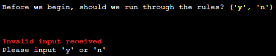
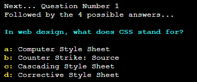
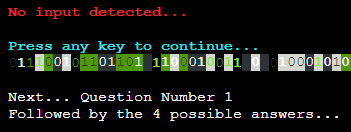

# Testing

[Back to main README](../README.md)

- [Testing](#testing)
  - [User Name](#user-name)
  - [Yes/No Validation - Rules](#yesno-validation---rules)
  - [Yes/No Validation - Keywords](#yesno-validation---keywords)
  - [Question Data](#question-data)
  - [Display Question](#display-question)
  - [Question Input](#question-input)
  - [Answer Response](#answer-response)
  - [Keywords](#keywords)
    - [Explanations](#explanations)
    - [Use](#use)
    - [Call](#call)
    - [Even](#even)
    - [Review](#review)
    - [Scores](#scores)
    - [Help](#help)
    - [Take](#take)
  - [Invalidate Current Token](#invalidate-current-token)

## User Name

The user name should be up to 18 characters in length. It may contain numbers,
letters and spaces. No special characters are valid and profanity is excluded via
the [`better_profanity`](../README.md#python-packages) package.

- Start the program and press enter with no input:  
  
  - A string reports that you must enter a user name.
  - Input is re-initiated.
- Start the program and enter a user name containing profanity:  
  
  - A string reports that profanity has been detected.
  - Input is re-initiated.
- Start the program and enter a user name containing invalid characters:  
  
  - A string reports that invalid characters have been
    detected.
  - Input is re-initiated.
- Start the program and enter a user name longer than 18 characters:  
   
  - A string reports that the user name is too long.
  - Input is re-initiated.
- Start the program and enter a valid user name:  
  
  - User name is accepted.
  - Program continues to [rules help](#yesno-validation---rules).

## Yes/No Validation - Rules

- With a valid user name:
  - Press enter with no input when `('y', 'n')` is present:  
    
    - A string reports an invalid input is received.
    - Input is re-initiated.
  - Press enter with an invalid input when `('y', 'n')` is present:  
    
    - A string reports an invalid input is received.
    - Input is re-initiated.
  - Press enter with a valid 'y' input when `('y', 'n')` is present:  
    
    - Program continues to the rules.
  - Press enter with a valid 'n' input when `('y', 'n')` is present:  
    
    - Program continues to
      [keyword help](#yesno-validation---keywords).

## Yes/No Validation - Keywords

- With a valid user name
- After displaying or passing the rules:
  - Press enter with no input when `('y', 'n')` is present:  
    - [*Similar image above*](#yesno-validation---rules)
    - A string reports an invalid input is received.
    - Input is re-initiated.
  - Press enter with an invalid input when `('y', 'n')` is present:  
    - [*Similar image above*](#yesno-validation---rules)
    - A string reports an invalid input is received.
    - Input is re-initiated.
  - Press enter with a valid 'y' input when `('y', 'n')` is present:  
    
    - Program continues to the [keywords](#explanations).
  - Press enter with a valid 'n' input when `('y', 'n')` is present:  
    
    - Program continues to load
      [question data](#question-data).

## Question Data

- With a valid user name
- After displaying or passing the rules
- After displaying or passing the keyword explanations
  - If the current token is valid:  
    
    - Data is successfully retrieved.
    - The program continues to [display the question](#display-question).
  - Copy the token string from the Google Sheet.
  - Set the current token to [invalid](#invalidate-current-token):  
    
    - The token is updated.
    - Data is successfully retrieved.
    - The program continues to [display the question](#display-question).

## Display Question

- With a valid user name
- After displaying or passing the rules
- After displaying or passing the keyword explanations
- With a valid token and successful data retrieval:  
  
  - An initial string is assigned before `Question Number X`.
  - The question data is printed.
  - The program continues to [question input](#question-input).
- If the question is longer than 80 characters:
  
  - The question string is split at a space and printed on multiple lines.
  - The program continues to [question input](#question-input).

## Question Input

- With a valid user name
- After displaying or passing the rules
- After displaying or passing the keyword explanations
- With a valid token and successful data retrieval
- Once the question has been displayed:
  - Press enter with no input:  
    
    - A string reports no input is received.
    - Question is re-rendered with the same string as previously shown.  
      
  - Press enter with an invalid input:
    
    - A string reports an invalid input is received.
    - Question is re-rendered with the same string as previously shown.
  - Press enter with a valid keyword input other than `help`:
    
    - A string identifies the keyword used.
    - An input is required to confirm the [keyword used](#keywords-use).
  - Press enter with `help` as an input:
    
    - The help and keyword information options
      are presented with a modified string.
    - Testing of these sections is detailed [above](#yesno-validation---rules).
    - Press enter with `n` as an input for keyword information:
      
      - A modified string is printed and the program continues by repeating the
        current question.
  - Press enter with an answer:
    - Input is valid and program continues to display
      [answer response](#answer-response).

## Answer Response

- With a valid user name
- After displaying or passing the rules
- After displaying or passing the keyword explanations
- With a valid token and successful data retrieval
- Once the question has been displayed
  - With a valid, incorrect answer:
    
    - A string indicates the answer was incorrect.
    - If the score achieved is lower than the lowest score on the score board
      a message is displayed to inform the user.

## Keywords

### Explanations

### Use

### Call

### Even

### Review

### Scores

### Help

### Take

## Invalidate Current Token

- Using a browser navigate to
  `https://opentdb.com/api.php?amount=^&category=18&difficulty=^^&type=multiple&token=^^^`
  - *`^` is equal to the number of remaining available questions for the
    current difficulty.*
  - *`^^` is the current difficulty.*
  - *`^^^` is the token string.*
- This causes the token to expire and allows testing of invalid tokens.
