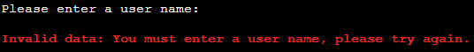
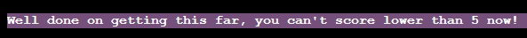
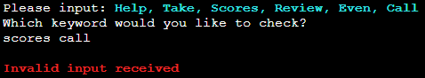

# Testing

[Back to README](../README.md)

- [Testing](#testing)
  - [User Name](#user-name)
  - [Yes/No Validation - Rules](#yesno-validation---rules)
  - [Yes/No Validation - Keywords](#yesno-validation---keywords)
  - [Question Data](#question-data)
  - [Display Question](#display-question)
  - [Question Input](#question-input)
  - [Answer Response](#answer-response)
  - [Keywords](#keywords)
    - [Explanations](#explanations)
    - [Activations](#activations)
      - [Review](#review)
      - [Call](#call)
      - [Even](#even)
      - [Multiple Keywords Used](#multiple-keywords-used)
      - [Scores](#scores)
      - [Take](#take)
      - [Help](#help)
      - [???](#???)
  - [Check/Update Scores](#checkupdate-scores)
  - [Win](#win)
  - [Play Again](#play-again)
  - [Exit](#exit)
  - [Invalidate Current Token](#invalidate-current-token)
  - [Modifying Scores For Quicker Testing](#modifying-scores-for-quicker-testing)

## User Name

The user name should be up to 18 characters in length. It may contain numbers,
letters and spaces. No special characters are valid and profanity is excluded via
the [`better_profanity`](../README.md#python-packages) package.

- Start the program and press enter with no input:  
  
  - A string reports that you must enter a user name.
  - Input is re-initiated.
- Start the program and enter a user name containing profanity:  
  
  - A string reports that profanity has been detected.
  - Input is re-initiated.
- Start the program and enter a user name containing invalid characters:  
  
  - A string reports that invalid characters have been
    detected.
  - Input is re-initiated.
- Start the program and enter a user name longer than 18 characters:  
   
  - A string reports that the user name is too long.
  - Input is re-initiated.
- Start the program and enter a valid user name:  
  
  - User name is accepted.
  - Welcome string is displayed.
  - Program continues to [rules help](#yesno-validation---rules).

## Yes/No Validation - Rules

- With a valid user name:
- OR After using the keyword [help](#help):
  - Press enter with no input when `('y', 'n')` is present:  
    
    - A string reports an invalid input is received.
    - Input is re-initiated.
  - Press enter with an invalid input when `('y', 'n')` is present:  
    
    - A string reports an invalid input is received.
    - Input is re-initiated.
  - Press enter with a valid 'y' input when `('y', 'n')` is present:  
    
    - Program continues to the rules.
  - Press enter with a valid 'n' input when `('y', 'n')` is present:  
    
    - Program continues to
      [keyword help](#yesno-validation---keywords).

## Yes/No Validation - Keywords

- With a valid user name
- After displaying or passing the rules:
  - Press enter with no input when `('y', 'n')` is present:  
    - [*Similar image above*](#yesno-validation---rules)
    - A string reports an invalid input is received.
    - Input is re-initiated.
  - Press enter with an invalid input when `('y', 'n')` is present:  
    - [*Similar image above*](#yesno-validation---rules)
    - A string reports an invalid input is received.
    - Input is re-initiated.
  - Press enter with a valid 'y' input when `('y', 'n')` is present:  
    
    - Program continues to the [keywords](#explanations).
  - Press enter with a valid 'n' input when `('y', 'n')` is present:  
    
    - Program continues to load
      [question data](#question-data).

## Question Data

- With a valid user name
- After displaying or passing the rules
- After displaying or passing the keyword explanations:
  - If the current token is valid:  
    
    - Data is successfully retrieved.
    - The program continues to [display the question](#display-question).
  - Copy the token string from the Google Sheet.
  - Set the current token to [invalid](#invalidate-current-token):  
    
    - The token is updated.
    - Data is successfully retrieved.
    - The program continues to [display the question](#display-question).

## Display Question

- With a valid user name
- After displaying or passing the rules
- After displaying or passing the keyword explanations
- With a valid token and successful data retrieval:  
  
  - An initial string is assigned before `Question Number X`.
  - The question data is printed.
  - The program continues to [question input](#question-input).
- If the question is longer than 80 characters:
  
  - The question string is split at a space and printed on multiple lines.
  - The program continues to [question input](#question-input).

## Question Input

- With a valid user name
- After displaying or passing the rules
- After displaying or passing the keyword explanations
- With a valid token and successful data retrieval
- Once the question has been displayed:
  - Press enter with no input:  
    
    - A string reports no input is received.
    - Question is re-rendered with the same string as previously shown.  
      
  - Press enter with an invalid input:  
    
    - A string reports an invalid input is received.
    - Question is re-rendered with the same string as previously shown.
  - Press enter with a valid keyword input other than `help`:  
    
    - A string identifies the keyword used.
    - An input is required to confirm the [keyword used](#keywords-use).
  - Press enter with `help` as an input:  
    
    - The help and keyword information options are presented with a modified
      string.
    - Testing of these sections is detailed [above](#yesno-validation---rules).
    - Press enter with `n` as an input for keyword information:  
      
      - A modified string is printed and the program continues by repeating the
        current question.
  - Press enter with an answer:
    - Input is valid and program continues to display
      [answer response](#answer-response).

## Answer Response

- With a valid user name
- After displaying or passing the rules
- After displaying or passing the keyword explanations
- With a valid token and successful data retrieval
- Once the question has been displayed:
  - Input a valid, incorrect answer:  
    
    - A string indicates the answer was incorrect.
    - Program continues to [check scores](#checkupdate-scores).
  - Input a valid, correct answer:  
    
    - A string indicates the answer is correct.
    - Program awaits a user key press.
    - If the question number is below 15:
      - If the question answered is number 5:  
        
        - A safety message is displayed.
        - A safety point is stored.
      - If the question answered is number 10:
        
        - A safety message is displayed.
        - A safety point is stored.
      - A new question is [displayed](#display-question).
    - If the question answered is number 15:
      - The winners message is [displayed](#win).

## Keywords

- With a valid user name
- After displaying or passing the rules
- After displaying or passing the keyword explanations
- With a valid token and successful data retrieval
- Once the question has been displayed:
  - Input a keyword from the available list (other than `help`):  
    
    - Input something other than the keyword.
    - The keyword function is not activated.
    - The program continues.
  - Input a keyword from the available list (other than `help`):  
    
    - Input the same keyword with additional spaces as confirmation.
    - The keyword function is [activated](#activations).
  - Input a keyword from the available list (other than `help`):  
    
    - Input the same keyword as confirmation.
    - The keyword function is [activated](#activations).

### Explanations

- With a valid user name
- After displaying or passing the rules
- Press enter with a valid 'y' input when `('y', 'n')` is present:
  
  - An input is required to specify which keyword to check.
  - Press enter with no input:  
    
    - A string states that no input is detected.
    - Returns to ask which keyword you would like to check.
  - Press enter with an input not in the keyword list:  
    
    - A string states that an invalid input is received.
    - Returns to ask which keyword you would like to check.
  - Press enter with multiple keywords as an input:  
    
    - A string states that an invalid input is received.
    - Returns to ask which keyword you would like to check.
  - Press enter with a valid keyword input:  
    
    - The keyword is explained.
    - Returns to ask if you would like to
      [check a keyword](#yesno-validation---keywords).
  - Press enter with spaces and a valid keyword input:  
    
    - The keyword is explained.
    - Returns to ask if you would like to
      [check a keyword](#yesno-validation---keywords).
- Press enter with a valid 'n' input when `('y', 'n')` is present:
  - A user key press is required if `help` has been used to access the keyword
    descriptions.
    
  - Program continues.

### Activations

- With a valid user name
- After displaying or passing the rules
- After displaying or passing the keyword explanations
- With a valid token and successful data retrieval
- Once the question has been displayed
- Once a keyword has been activated (not required for `help`):

#### Review

- A line of question marks is printed.
- Some strings indicate that the keyword is taking effect.
- The available answers letters are printed with a percentage vote next to
  them.
- The question is rendered with the percentages appended to the answers.  

- The user may enter an input and [continue](#question-input).
- The `review` keyword is removed from the list of available keywords.

    The highest percentage is always right for the first five questions and has a
    higher chance of being correct on questions 6 - 10 than 11 - 15.

#### Call

- A line of telephone symbols is printed.
- Some strings are printed followed by `📞 Hi, {user_name}...`
- A string is printed with an answer inserted, the line is preceded by 📞.
- Another line of telephones is printed.
- The advised answer is repeated.
- The question is rendered with 📞 appended to the advised answer.

- The user may enter an input and [continue](#question-input).
- The `call` keyword is removed from the list of available keywords.
  

    The advised answer is always right for the first five questions and has a
    high chance of being correct on questions 6 - 10. The response from the
    companion reflects whether they are certain or not.

#### Even

- A line of 50/50 fractions is printed.
- Some strings indicate that the keyword is taking effect.
- The question is rendered with a reduced number of answers.

- One of the answers is correct, one is incorrect.
- The user may enter an input and [continue](#question-input).
- The `even` keyword is removed from the list of available keywords.

#### Multiple Keywords Used

- If multiple keywords are used in succession on the same question, the results
  are rendered accordingly.
- Percentages will always appear first, followed by a phone.  
  
- If `even` is used after `review` or `call`, the percentages are not updated
  and the phone may not appear if the companion has advised a wrong answer that
  is subsequently removed.  
  
- If `even` is used before `review` or `call`, the percentages of call are
  calculated on just 2 answers. One of the two remaining answers is chosen by
  the companion.
  

#### Scores

- A couple of strings will indicate the scores are being queried and rendered.
- Each line will print with a 0.2 second delay.
- The first line consists of alternating stars.
- Subsequent lines consist of a star at either end with the current user and
  score presented.
- A final line of stars is printed in reverse to the initial line.
- Some information regarding the current user score in comparison to the board
  is printed.
- A user input is required to return to the quiz.

#### Take

- The user is informed they have decided to end the quiz.
  
- Program continues to [check scores](#checkupdate-scores).

#### Help

- *No confirmation is required for this keyword.*
- User is able to remind themselves of the
  [rules and keywords](#yesno-validation---rules).
- The string is modified from the initial run.  
  

#### ???

- The secret keyword is checked by use of a specific input.
- It works...you will just have to trust me.

## Check/Update Scores

- With a valid user name
- After displaying or passing the rules
- After displaying or passing the keyword explanations
- With a valid token and successful data retrieval
- Once the question has been displayed
- With a valid, incorrect answer:
- OR Following the use of the keyword `take`:
  - The score is calculated and safety points are taken into consideration.
  - If the score is too low to be presented on the score board:
    
    - The user is informed their score is not high enough.
  - If the score is high enough to be entered on the score board:
    
    - The user is informed the scores have been updated.
    - If there are multiple scores ahead of the user:
    
      - A message is displayed to inform the user how many people are above
        them on the score board.
    - If there is a single score ahead of the user:
    
      - A message is displayed to inform the user they reached second on the
        score board.
    - If the user has the highest score:
    
      - A message is displayed to inform the user they are top of the score
        board.
  - If the score is equal to an identical user name's existing score:
    
    - A message is displayed to inform the user that there is already a score
      with their user name in the score board.
    - Scores will not be updated.
  - If the user has completed 15 questions:  
    
    - A message is displayed indicating the user's score is at the top.
    - Multiple winning entries are allowed under the same user name.
  - The Google Sheet is updated as necessary.
  - An option to [replay is offered](#play-again).

## Win

- With a valid user name
- After displaying or passing the rules
- After displaying or passing the keyword explanations
- With a valid token and successful data retrieval
- Once the question has been displayed
- If the user answers 15 questions correctly:
  - A congratulations message is displayed.  
    
  - [Scores are updated](#checkupdate-scores).
  - An option to [replay is offered](#play-again).

## Play Again

- An option to replay is displayed.
  - Enter `y`:  
  
    - A welcome back message is displayed.
    - Available keywords are reset.
    - The first question data is [retrieved](#question-data).
  - Enter `n`:
    - The [exit](#exit) screen is shown.
  - Enter an input other than `y` or `n`:  
    
    - A string indicates and invalid input.
    - User input is requested again.
  - Do not enter an input:  
    
    - A string indicates and invalid input.
    - User input is requested again.

## Exit

- The exit screen is displayed  
  

## Invalidate Current Token

- Using a browser navigate to
  `https://opentdb.com/api.php?amount=^&category=18&difficulty=^^&type=multiple&token=^^^`
  - *`^` is equal to the number of remaining available questions for the
    current difficulty.*
  - *`^^` is the current difficulty.*
  - *`^^^` is the token string.*
- This causes the token to expire and allows testing of invalid tokens.

## Modifying Scores For Quicker Testing

- Navigate to the Google Sheet using a browser.
- Depending on intended result, modify scores to allow easy testing after 1
  question is answered correctly:
  - For top score without winning, set all scores to 0.
  - For second highest score, set top score to a value higher than 1. Set
    all other scores to 0.
  - For a similar score with same user name, set a user name identical to the
    test user name and set the score to 1.
  - For dislaying calculated score position, set lower position scores to 0 and
    upper scores to a value higher than 1.
- To show score is not high enough to enter score board, set all scores to a
  value higher than one. `Take` before answering the first question.
