# Validation

[Back to README](../README.md)

- [Validation](#validation)
  - [PEP8 Validation](#pep8-validation)
    - [Keywords](#keywords)
    - [Matrix](#matrix)
    - [Max_line_length](#max_line_length)
    - [Prints](#prints)
    - [Questions](#questions)
    - [Quiz](#quiz)
    - [Rules](#rules)
    - [Run](#run)
    - [Sheets](#sheets)
    - [Tokens](#tokens)
    - [User_name](#user_name)
    - [Validate_yn](#validate_yn)
  - [Linters](#linters)
    - [Flake8](#flake8)
    - [Pylint](#pylint)

## PEP8 Validation

No errors are reported. W503 is the only warning reported but has been
explained in the main README file.

### Keywords

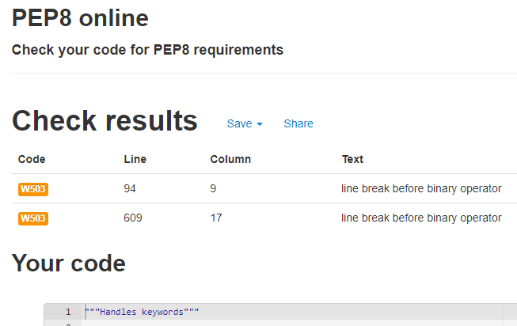

### Matrix

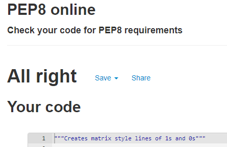

### Max_line_length

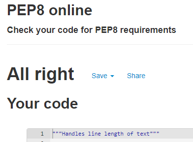

### Prints

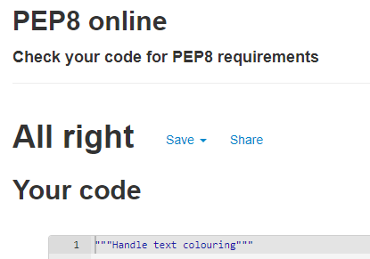

### Questions

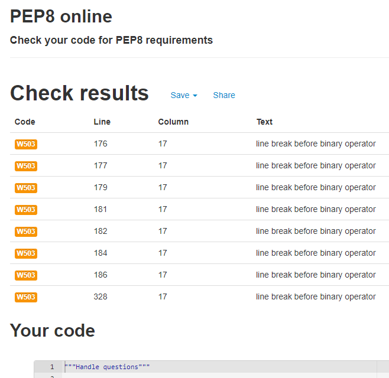

### Quiz

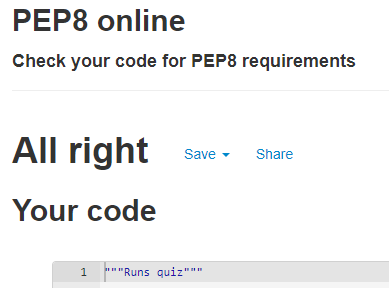

### Rules

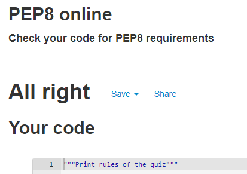

### Run

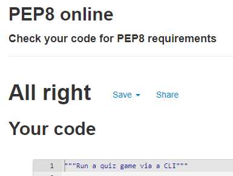

### Sheets

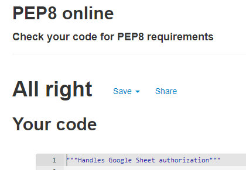

### Tokens

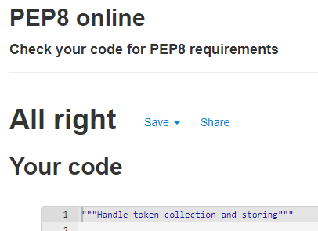

### User_name

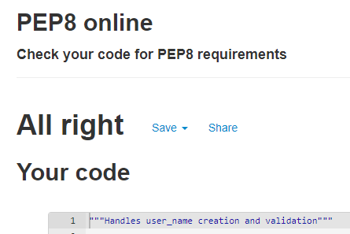

### Validate_yn

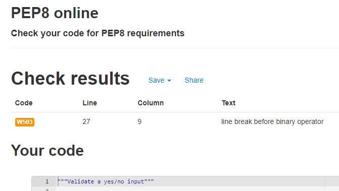

## Linters

### Flake8

No issues are reported from Flake8. The `.venv` directory has been excluded as
it contains the installed python packages and the errors within those files are
beyond my control.

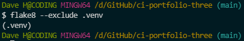

### Pylint

A number of warnings and errors are reported by pylint.

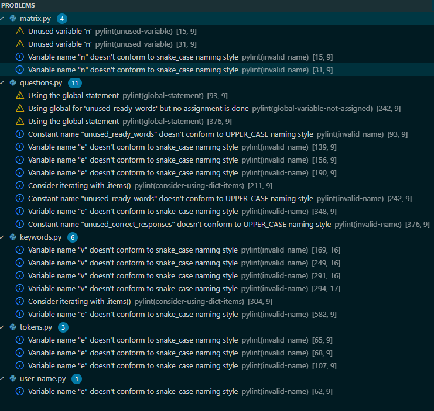

- Unused variables are referenced when for loops have been used to iterate
  through a range to perform an action a set number of times, or when working
  with `dict` objects.

  ```python
  for n in range(80):
        line = line + (str(MATRIX_CHARS[
            randrange(len(MATRIX_CHARS))]))
  ```

- Single letter variables cannot conform to snake_casing. The variable are used
  in places that do not need longer, more descriptive variable names.

  ```python
  for k, v in reviewed_answers.items():
  ```

- Snake_case naming has been used for variables that will be manipulated via
  the use of the global statement. The use of `global` has been thoroughly
  checked so as to not cause errors.
- 'Using global for `unused_ready_words` but no assignment is done' is a
  false warning. The code block below shows that the `.remove()` method is
  used on the list.

  ```python
  global unused_ready_words

  matrix_line()
      pre_question_str = ""
      if first_attempt:
          if not unused_ready_words:
              self._reset_ready_words()
          pre_question_str = unused_ready_words[
              randrange(len(unused_ready_words))]
          unused_ready_words.remove(pre_question_str)
  ```

- 'Consider iterating with `.items()`' is identified twice. I do not feel the
  code is significantly more verbose without using the additional method.

  ```python
  for k in abcd:
            if abcd[k] == correct_answer:
                correct_answer_letter = k
  ```
